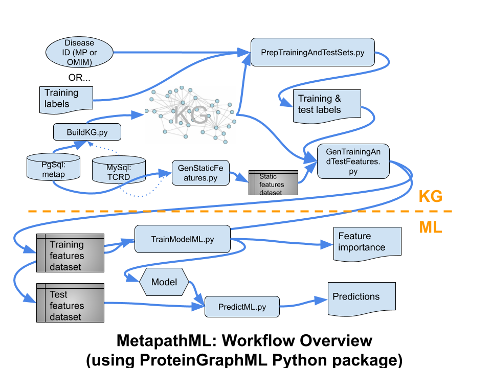

# ProteinGraphML

This software is designed to to predict disease-to-protein (protein-coding
gene) associations, from a biomedical knowledge graph, via machine learning (ML).
This codebase abstracts the ML from the domain knowledge and data sources, to
allow reuse for other applications. The input PostgreSQL relational database is
converted to a knowledge graph, then converted to feature vectors by metapath
matching, based on an input disease, defining a training set of proteins. Then
XGBoost is used to generate and optimize a predictive model.

## Table of Contents  

* [Dependencies](#Dependencies)
* [How to Run Workflow](#Howto)
   * [Build KG](#HowtoBuildKG)
   * [Generate Static Features](#HowtoStaticFeatures)
   * [Prepare Training and Test Sets](#HowtoPrep)
   * [Generate Metapath Features](#HowtoMetapathFeatures)
   * [Train ML Model](#HowtoTrainML)
   * [Predict Using Trained Model](#HowtoPredictML)
* Also see
   * [ComparingResults (Python vs R)](doc/ComparingResults.md)
   * [Visualization](doc/Visualization.md) _(In development.)_

## <a name="Dependencies"/>Dependencies

* R 3.5+
* R packages: `data.table`, `Matrix`, `RPostgreSQL`
* Python 3.4+
* Python packages: `xgboost`, `scikit-learn`, `networkx`, `pandas`, `pony`, `matplotlib`, `xlrd`, `XlsxWriter`
* PostgreSQL database `metap`.
   * Edit `DBcreds.yaml` with valid db credentials. Needed throughout workflow.
* Hardware: Some of the programs need 20+ GB RAM and Xgboost takes several minutes to train and test the data if the number of CPU cores is less than 8. So, a machine with 20+ GB RAM and 8+ CPU core is preferable for running these codes.

## <a name="Howto"/>How to run the Workflow:

The command-line programs of ProteinGraphML must be executed in the following order.
However, the __BuildKG__ and __StaticFeatures__ are one-time steps, re-useable for
multiple ML models. Re-run only required if database updated.

### <a name="HowtoBuildKG"/>Build KG

`BuildKG.py`, from the relational db, generates a knowledge graph,
a `ProteinDiseaseAssociationGraph`, saved as a pickled `networkX` graph. 
Via the adapter and [`pony`](https://docs.ponyorm.org)
object-relational model (ORM), nodes and edges are queried from the db to comprise the
graph.

Command line parameters:

* `--o` : Pickled KG file.
* `--db` : database (olegdb or tcrd) to use to build KG (default: tcrd).
* `--logfile` : KG log file (optional).
* `--cyjsfile`: Save KG as CYJS file. (optional).
* `--graphmlfile` : Save KG as graphML. (optional).
* `--tsvfile` : Save KG as TSV file. (optional).

Example commands:

```
BuildKG.py -h
BuildKG.py --db olegdb --o ProteinDisease_GRAPH.pkl
BuildKG.py --db olegdb --o ProteinDisease_GRAPH.pkl --logfile ProteinDisease_GRAPH.log --cyjsfile ProteinDisease_GRAPH.cyjs --tsvfile ProteinDisease_GRAPH.tsv
```

### <a name="HowtoStaticFeatures"/>Static Features

`GenStaticFeatures.py` generates files for static features: lincs, hpa, gtex, and ccle for use by `GenTrainingAndTestFeatures.py`. Static features are _not_ dependent on training set labels, only the database, 
so the same TSV files can be reused for all models, and only needs to be re-run if
the database changes.  ___Note: Requires large memory server, approximately 100GB+,
80GB for this process.___

Command line parameters:

* `--db` : database (olegdb or tcrd) to use to generate static features (default: tcrd)
* `--outputdir` : output folder to save TSV files.
* `--sources` : static features (default: ["gtex", "lincs", "ccle", "hpa"]).
* `--decimals` : decimal place for the values (default:3)
```
GenStaticFeatures.py --db olegdb --source "gtex,hpa" --outputdir static_olegdb  (only 
gtex and hpa)
GenStaticFeatures.py --db olegdb --outputdir static_olegdb  (for all 4 static features)
```

### <a name="HowtoPrep"/>Prepare Training and Test Sets

`PrepTrainingAndTestSets.py` generates two files:

1.  A `pickle`ed Python dictionary that
contains protein_ids for both class 'True' and 'False'. This training set file is needed
for running ML for a disease defined by a custom labeled training set,
rather than a Mammalian Phenotype (MP) term ID. The custome labeled training set may
reference proteins via `protein_id`s or gene symbols; if gene symbols, this code fetches
the corresponding `protein_id` for each symbol from the database. The prepared,
picked training set uses `protein_id`s.
1. A `pickle`ed test set of protein_ids, unlabeled, defining the predictions of
interest, for testing the trained model.

Command line parameters:

* `--i` : Input file that contains protein_ids/symbols and labels for a given disease, with extension (csv|txt|xlsx|rds).
* `--symbol_or_pid` : "symbol" or "pid" (default: symbol).
* `--use_default_negatives` : Use default negatives, ~3500 genes with known associations but not with query disease. If false, input training set must include negatives.
* `--db` : database (olegdb or tcrd) (default: tcrd)

If the file is a spreadsheet, the header should have "Protein_id Label" or "Symbol Label" and the sheet name should be "Sheet1".
If the file is a text file, the Protein_id/symbol and
Label should be comma-separated. There should not be any header in the text file. 
If a disease is not present in the graph, use the corresponding RDS file in this program to generate sets of training and predict protein ids. E.g. 104300.rds, PS168600.rds

Example commands:

```
PrepTrainingAndTestSets.py -h
PrepTrainingAndTestSets.py --i data/diabetes_pid.txt --symbol_or_pid 'pid' --db olegdb
PrepTrainingAndTestSets.py --i data/autophagy.xlsx --db olegdb
PrepTrainingAndTestSets.py --i data/diabetes.xlsx --use_default_negatives --db olegdb
PrepTrainingAndTestSets.py --i data/Asthma.rds --db olegdb
```

### <a name="HowtoMetapathFeatures"/>Metapath Features

To generate metapath features from the KG, use `GenTrainingAndTestFeatures.py`. From the KG
and hard coded metapath patterns, plus the positively labeled proteins in the
training set, feature vectors are generated for all training cases and optionally
predict cases. Normally, any human proteins not in the labeled training set 
will be in the predict set.  Metapath-based features
must be generated for each model (unlike static features), since how metapath 
semantic patterns match the KG depends on the query disease. Mammalian Phenotype ID can also be used
with this program to generate training and predict data sets for ML models.

Command line parameters:

*  `--disease` : Mammalian Phenotype ID, e.g. MP_0000180 (Diseases without MP_TERM_ID may give error. So, use their 
RDS files to create sets of training and predict protein ids using `PrepTrainingAndTestSets.py`)
*  `--trainingfile` : pickled training set, e.g. "diabetes.pkl"
*  `--predictfile` : pickled predict set, e.g. "diabetes_test.pkl"
*  `--outputdir` : directory where train and test data with features will be saved, e.g. "diabetes_no_lincs"
*  `--kgfile` : input pickled KG (default: "ProteinDisease_GRAPH.pkl")
*  `--static_data` : (default: "gtex,lincs,ccle,hpa")
*  `--static_dir` : directory of static features files: lincs.tsv, hpa.tsv, gtex.tsv, and ccle.tsv
*  `--db` : database (olegdb or tcrd) (default: tcrd)

Example commands:

```
GenTrainingAndTestFeatures.py -h
GenTrainingAndTestFeatures.py --trainingfile data/ATG.pkl --predictfile data/ATG_predict.pkl --outputdir results/ATG --kgfile ProteinDisease_GRAPH.pkl --static_data "gtex" --static_dir static_olegdb --db olegdb
GenTrainingAndTestFeatures.py --disease MP_0000180 --outputdir results/MP_0000180 --kgfile ProteinDisease_GRAPH.pkl --static_data "gtex,lincs,ccle,hpa" --static_dir static_olegdb --db olegdb
GenTrainingAndTestFeatures.py --trainingfile data/PS118220.pkl --predictfile data/PS118220_predict.pkl --outputdir results/PS118220 --kgfile ProteinDisease_GRAPH.pkl --static_data "gtex,lincs,ccle,hpa" --static_dir static_olegdb --db olegdb
```

### <a name="HowtoTrainML"/>Train ML Model

`TrainModelML.py`, from the training set feature vectors, or a training set
implicated by specified disease (Mammalian Phenotype ID), 
executes the specified ML procedure, training a predictive model, then saved to a
reusable file (.model).  The procedure `XGBGridSearch` uses
XGBoost, trains a model with cross-validation and grid-search parameter optimization,
generates a list of important features used by the classification model.

Command line parameters:

* `PROCEDURE` (positional parameter):
   * `XGBGridSearch` :  Grid search for optimal XGBoost parameters.
   * `XGBCrossValPred` :  5-fold cross-validation, one iteration. 
   * `XGBKfoldsRunPred` : 5-fold cross-validation, multiple iterations. In each iteration, data is randomly divided into
   train and test set (80:20). Model trained on train set is tested on test set. The average, min and max AUC are computed
   using the classification results of test data. 
* `--trainingfile` : Training set file, produced by `GenTrainingAndTestFeatures.py`.
* `--resultdir` : directory for output results
* `--nrounds_for_avg` : number of iterations to compute average AUC, accuracy, and MCC. This is used for procedure `XGBKfoldsRunPred`.  
* `--rseed` : random seed that XGBoost should use for procedure `XGBGridSearch` (default:1234)
* `--nthreds` : number of CPU threads for procedure `XGBGridSearch` (default:1).
* `--xgboost_param_file` : XGBoost configuration parameter file (e.g. XGBparams.txt). This is used for `XGBCrossValPred` and `XGBKfoldsRunPred`. XGBparams.txt created by GridSearch can be used for this parameter. Modify XGBparams.txt if any parameter needs to be changed.
*  `--db` : database (olegdb or tcrd) (default: tcrd)
*  `--static_data` : (default: "gtex,lincs,ccle,hpa")
*  `--static_dir` : directory of static features files: lincs.tsv, hpa.tsv, gtex.tsv, and ccle.tsv

Example commands:

```
TrainModelML.py -h
TrainModelML.py XGBGridSearch --trainingfile results/ATG/ATG_TrainingData.pkl --rseed 1234 --nthreads 32 --resultdir results/ATG --db olegdb --static_data "gtex,lincs,ccle,hpa" --static_dir static_olegdb
TrainModelML.py XGBCrossValPred --trainingfile results/ATG/ATG_TrainingData.pkl --resultdir results/ATG --xgboost_param_file XGBparams.txt --db olegdb --static_data "gtex,lincs,ccle,hpa" --static_dir static_olegdb
TrainModelML.py XGBKfoldsRunPred --trainingfile results/ATG/ATG_TrainingData.pkl --resultdir results/ATG --xgboost_param_file XGBparams.txt --nrounds_for_avg 5 --db olegdb --static_data "gtex,lincs,ccle,hpa" --static_dir static_olegdb
```

Results will be saved in the specified --resultsdir. See logs for specific
subdirectories and output files, including:

* Saved XGBoost model (.model).
* Feature importance lists (.tsv, .xlsx).

### <a name="HowtoPredictML"/>Test Trained ML Model

`PredictML.py`, Using the model trained on the training set and KG, predicts the probability of True class for
proteins. The procedure `XGBPredict` uses the saved XGBoost model, and generates results for predictions on all proteins in the test set. 

Command line parameters:

* `PROCEDURE` (positional parameter):
   * `XGBPredict` :  load the saved model
* `--modelfile` : trained model (e.g. results/autophagy_test20191003/XGBCrossVal.model).
* `--predictfile` : predict data file, produced by `PrepTrainingAndTestSets.py` (e.g.  "diabetesPredictData.pkl")
* `--resultdir` : directory for output results
* `--infofile` : protein information file with full path. The file should contain tdl, fam, uniprot data.
* `--db` : database (olegdb or tcrd) (default: tcrd)

Example commands:

```
PredictML.py -h
PredictML.py XGBPredict --predictfile results/ATG/ATG_predict_PredictData.pkl --model results/ATG/XGBCrossValPred.model --resultdir results/ATG --db olegdb --infofile data/plotDT.xlsx
```

Results will be saved in the specified --resultsdir. See logs for specific
subdirectories and output files, including:

* Predictions with probabilities for all proteins (.tsv, .xlsx).

## <a name="Notes"/>Notes

* The code currently assumes that all nodes are unique, that proteins are integer IDs, and the only ints in the graph. 
* New data sources can be supported by adding new Adapter class in `ProteinGraphML/DataAdapter/`.
* New ML procedures may be added to `ProteinGraphML/MLTools/Procedures/`.

Workflow overview diagram:

> 
